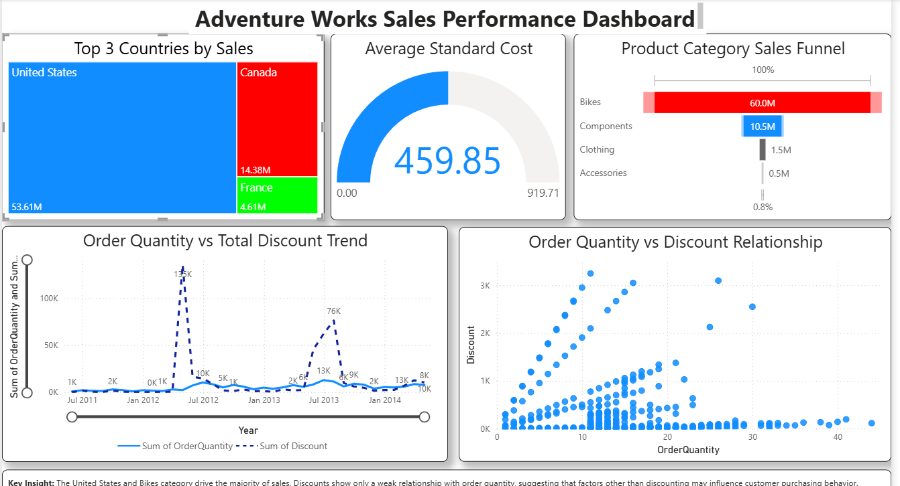

# 📊 Power BI Sales Analytics Dashboard

## Project Overview

This project presents an interactive **Sales Analytics Dashboard** developed using **Power BI** and the **Adventure Works dataset**. The dashboard provides insights into sales performance, product categories, regional sales distribution, standard costs, and the relationship between order quantities and discounts.

---

## 🎯 Objectives

* Analyze sales performance across different countries.
* Identify top-performing product categories.
* Evaluate average product standard costs.
* Examine the relationship between order quantity and discount.
* Create an interactive and visually appealing dashboard using Power BI.

---

## 🛠️ Tools & Technologies

* **Power BI Desktop**
* **Microsoft Excel**
* **Power Query**
* **Data Visualization**
* **Business Analytics**

---

## 📂 Dataset

The dataset contains information related to:

* Product Categories
* Product Subcategories
* Products
* Countries
* Sales Territories
* Order Dates
* Sales
* Standard Costs
* Discounts
* Order Quantities

---

## 📈 Dashboard Components

### 1. Top 3 Countries by Sales (Treemap)

* Visualized sales by country using a Treemap.
* Applied Top N filtering to identify the highest-performing countries.
* Highlighted the top three countries using distinct colors.

### 2. Average Standard Cost (Gauge Chart)

* Displayed the average standard cost of products.
* Used a Gauge visual for quick performance assessment.

### 3. Product Category Sales Funnel

* Compared sales performance across product categories.
* Highlighted the highest-selling category (**Bikes**) in red.

### 4. Order Quantity vs Discount Trend

* Line chart used to analyze changes in order quantity and discount over time.

### 5. Order Quantity vs Discount Relationship

* Scatter plot used to investigate the relationship between order quantity and discount.
* Observed a weak positive relationship with several outliers.

---

## 🔍 Key Insights

* **United States** generated the highest sales revenue.
* **Canada** and **France** were the next best-performing countries.
* **Bikes** contributed the largest share of total sales.
* The average standard cost across products was approximately **454.41**.
* Most orders received relatively low discounts regardless of quantity.
* The relationship between order quantity and discount was weak, indicating that larger quantities do not always lead to significantly higher discounts.

---

## 📊 Dashboard Preview


Example:

```markdown

```

---

## 🚀 Learning Outcomes

* Data cleaning and transformation using Power Query.
* Building interactive dashboards in Power BI.
* Applying business analytics techniques to real-world sales data.
* Creating professional visualizations and extracting actionable insights.
* Presenting findings through data storytelling.

---

## 📁 Repository Structure

```text
PowerBI-Sales-Analytics-Dashboard/
│
├── AdventureWorks_Sales_Dashboard.pbix
├── AdvWorksData.xlsx
├── Dashboard_Screenshot.png
└── README.md
```

---

## 👨‍💻 Author

**Neel Kapadi**

M.Tech Student, IIT Guwahati

Interested in:

* Business Analytics
* Data Analytics
* Machine Learning
* Data Visualization
